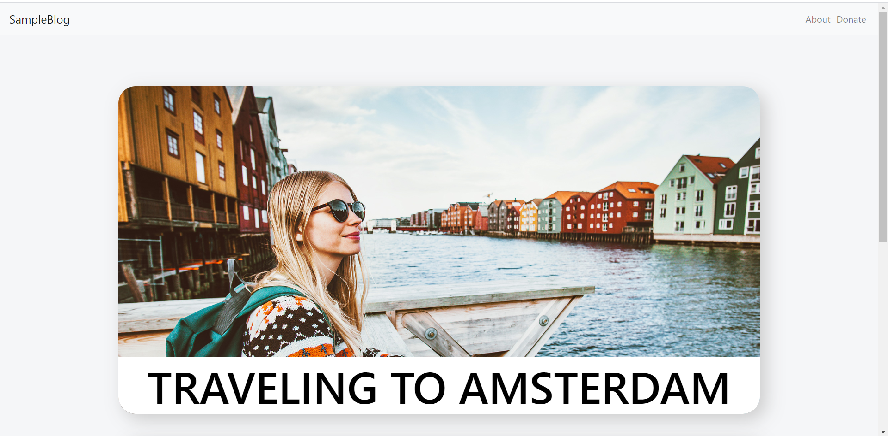
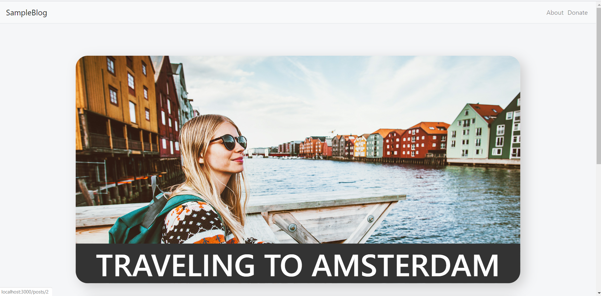
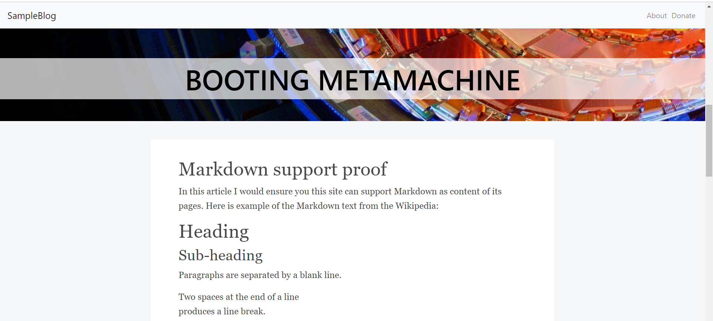
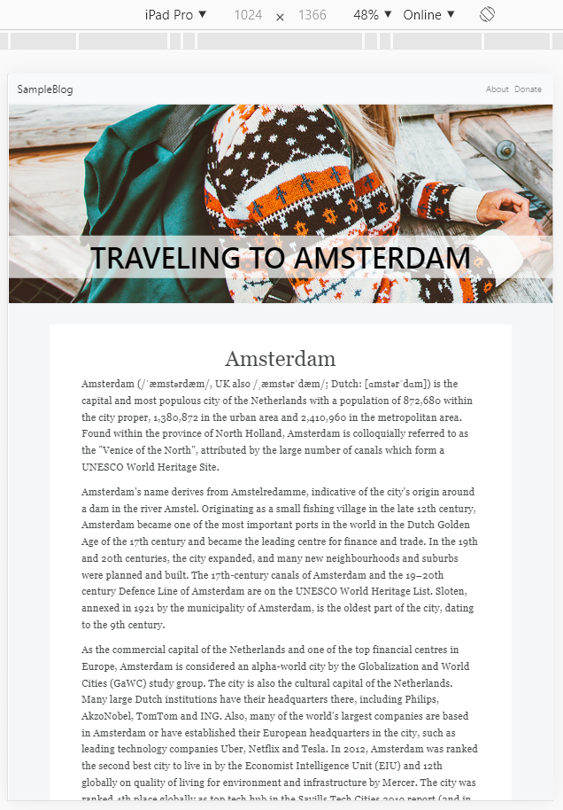
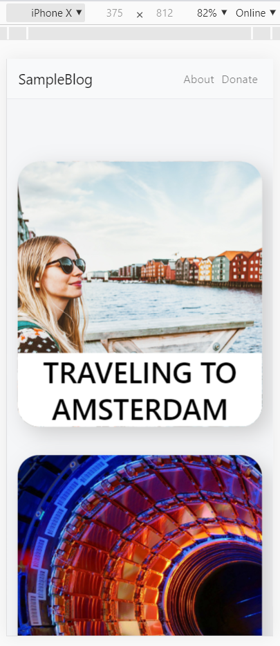

# SampleBlog

The main goal of this project is to build a front-end application using one of the mainstream frameworks with the 
server-side support.
This application has been built using ReactJS in the scope of my work for the 'Web Development' class.
Its functionality is very minimalistic, but I consider it is a solid foundation for future improvements.
The theme of this site is a blog.
It consists only from a few pages, such as:
1) Main page with all the blog posts listed.
2) Post page with the post's content.
3) About and Donate pages are empty and serve for navbar population purposes only.
Also, there is a sticky navbar with the title and a few links.

So, basically, this application is the read-only application that retrieves all the information from the server-side.
The main logic is implemented on the server-side as well. 
You can find back-end side following this link: [sample-blog-back](https://github.com/shevtsiv/sample-blog-back)
The design is fully responsive(actually I'm not sure).

Some screenshots:

